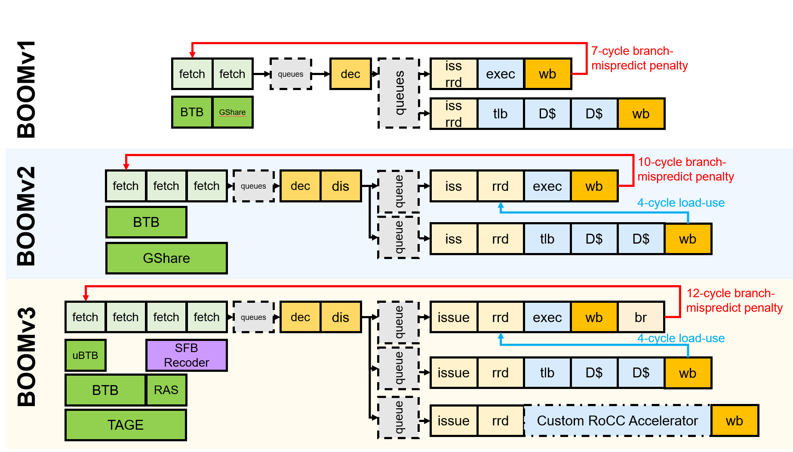
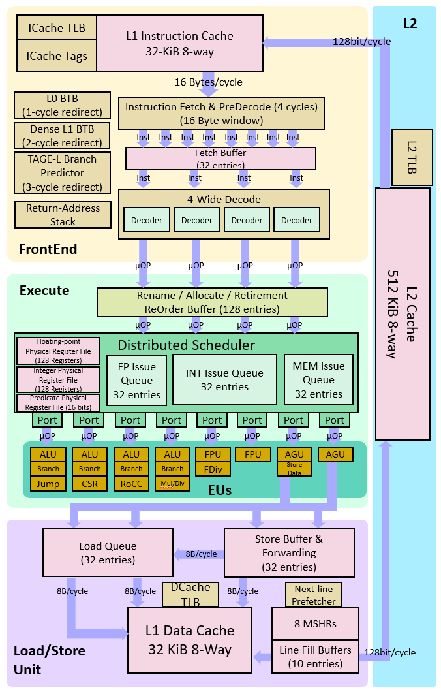

The Berkeley Out-of-Order RISC-V Processor [](https://circleci.com/gh/riscv-boom/riscv-boom)
====================================================================================================================================================================

The Berkeley Out-of-Order Machine (BOOM) is a synthesizable and parameterizable open source RV64GC RISC-V core written in the [Chisel](https://chisel.eecs.berkeley.edu/) hardware construction language.
Created at the University of California,
Berkeley in the [Berkeley Architecture Research](https://bar.eecs.berkeley.edu/) group, its focus is to create a high performance, synthesizable, and parameterizable core for architecture research.
The current version of the BOOM microarchitecture ([SonicBOOM, or BOOMv3](https://carrv.github.io/2020/papers/CARRV2020_paper_15_Zhao.pdf)) is performance competitive with commercial high-performance out-of-order cores, achieving 6.2 CoreMarks/MHz.




Feature | BOOM
--- | ---
ISA | RISC-V (RV64GC)
Synthesizable |√
FPGA |√
Parameterized |√
IEEE 754 Floating Point |√
Atomics |√
Caches |√
Virtual Memory |√
Boots Linux |√
Runs SPEC |√
CoreMark/MHz |6.2


## IMPORTANT: Using BOOM
This repository is **NOT A SELF-RUNNING** repository. To instantiate a BOOM core, please use the
[Chipyard](https://github.com/ucb-bar/chipyard) SoC generator.

The current hash of Chipyard that works with this repository is located in the `CHIPYARD.hash`
file in the top level directory of this repository. This file is mainly used for CI purposes, since
Chipyard should follow the correct version of rocket-chip. For most users, you should be able to
clone Chipyard separately and follow the default Chipyard instructions (without having to use the `.hash` file).

While BOOM is primarily ASIC-optimized, it is also usable on FPGAs.
Chipyard provides infrastructure and documentation for deploying BOOM on AWS F1 FPGAs through FireSim.

## Documentation and Information

Please check out the BOOM website @ https://boom-core.org for the most up-to-date information.
It contains links to the mailing lists, documentation, design spec., publications and more!

If you use BOOMv3 in your published work, please cite BOOM as

```
@article{zhaosonicboom,
  title={SonicBOOM: The 3rd Generation Berkeley Out-of-Order Machine},
  author={Zhao, Jerry and Korpan, Ben and Gonzalez, Abraham and Asanovic, Krste},
  booktitle={Fourth Workshop on Computer Architecture Research with RISC-V},
  year={2020},
  month={May}
}
```

**Website:** (www.boom-core.org)

**Mailing List** (https://groups.google.com/forum/#!forum/riscv-boom)

## Disclaimer!

BOOM is a work-in-progress and remains in active development.

## Contributing

Please see [CONTRIB\_AND\_STYLE.md](/CONTRIB_AND_STYLE.md)
